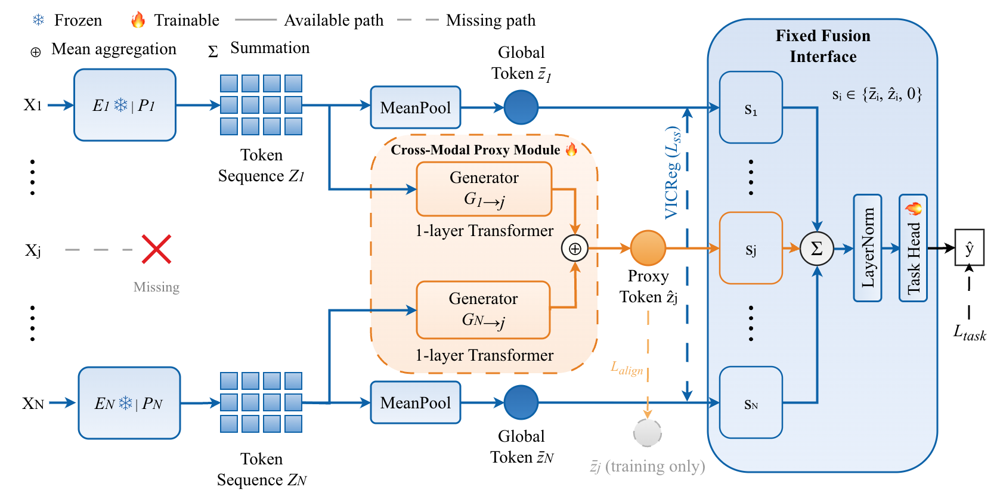

# COMPASS

This repository is the official code implementation of the paper:

> **COMPASS: Complete Multimodal Fusion via Proxy Tokens and Shared Spaces for Ubiquitous Sensing**<br>
> Hao Wang, Yanyu Qian, Pengcheng Weng, Zixuan Xia, William Dan, Yangxin Xu, and Fei Wang<br>
> [arXiv:2604.02056v2](https://arxiv.org/abs/2604.02056v2)

COMPASS learns cross-modal proxy tokens for unavailable sensors and maps real and generated representations into a shared task space. One trained model can therefore operate on every non-empty subset of the modalities available at training time.



## Installation

The supported environment is defined only by `pyproject.toml` and `uv.lock`. It uses Python 3.11, PyTorch 2.1.1, torchvision/torchaudio 0.16.1/2.1.1, and CUDA 12.1. With [uv](https://docs.astral.sh/uv/):

```bash
uv sync --frozen
```

## Prepare datasets, extracted features, pretrained backbones, and checkpoints

### Download datasets

Download and extract the three datasets from their official sources:

- **XRF55:** download [Part 1](https://www.kaggle.com/datasets/xrfdataset/xrf55) from the [official project page](https://aiotgroup.github.io/XRF55/). The reported experiments use Part 1 only; Part 2 is not used. After extracting it, run the included script to apply the official repetition-based split while preserving the scene layout required by the loader:

  ```bash
  uv run python XRF55_HAR/split_xrf55_all_scenes.py \
    --src /path/to/xrf55_1_extracted \
    --dst data/XRF55
  ```

  Repetitions 1–14 are used for training and repetitions 15–20 for testing, producing 15,400 training samples and 6,600 test samples.
- **MM-Fi:** download all four parts from the [official Google Drive](https://drive.google.com/drive/folders/1zDbhfH3BV-xCZVUHmK65EgVV1HMDEYcz?usp=sharing). Follow the [official MM-Fi toolbox](https://github.com/ybhbingo/MMFi_dataset) instructions to prepare the dataset and configure the train/test split.
- **OctoNet:** the main reproduction command uses the pre-extracted backbone features described below and does not require the raw dataset. To regenerate those features, follow the download and dataset-preparation instructions in the [official OctoNet repository](https://github.com/aiot-lab/OctoNet); its `OctonetBenchmark` data loader and ResNet implementation are used during feature extraction.

### Download extracted features, pretrained backbones, and COMPASS checkpoints

For XRF55 and MM-Fi, use the modality-specific backbones released with [X-Fi](https://github.com/xyanchen/X-Fi) and follow its official pretrained weight instructions. These weights are not redistributed by this repository and remain subject to the X-Fi license. Place the required files at:

```text
XRF55_HAR/backbone_models/
├── mmWave/mmwave_ResNet18.pt
├── WIFI/wifi_ResNet18.pt
└── RFID/RFID_ResNet18.pt

MMFI_HAR/backbones/
├── RGB_benchmark/RGB_Resnet18.pt
├── depth_benchmark/depth_Resnet18.pt
├── lidar_benchmark/lidar_all_random.pt
└── mmwave_benchmark/mmwave_all_random_TD.pt
```

The pretrained COMPASS checkpoints for all three datasets, the pre-extracted
OctoNet backbone features, and the five OctoNet ResNet-18 backbones are hosted in our
[Google Drive folder](https://drive.google.com/drive/folders/1NCgLT66aFfjCCN5feftOBVHkTRsSLhnr?usp=sharing).
Place `features.pt` at:

```text
OctoNet_HAR/features/features.pt
```

The OctoNet backbones are needed only to regenerate `features.pt`. They are
distributed as `octonet_resnet18_backbones.zip` and use the following layout:

```text
OctoNet_HAR/backbones/
├── imu/resnet18.pth
├── uwb/resnet18.pth
├── wifi/resnet18.pth
├── tof/resnet18.pth
└── mmwave/resnet18.pth
```

When the data-root environment variables below are not set, the loaders and
the optional OctoNet feature-extraction script expect external data at these
repository-local paths:

```text
.
├── data/
│   ├── XRF55/
│   │   ├── train_data/
│   │   └── test_data/
│   ├── MMFi/
│   │   └── E01/S01/A01/
│   │       ├── rgb/
│   │       ├── depth/
│   │       ├── lidar/
│   │       └── mmwave/
│   └── OctoNet/
│       └── dataset/
│           ├── cut_manual.csv
│           ├── imu/
│           ├── node_1/
│           └── ...
└── third_party/
    └── OctoNet/
        └── OctonetBenchmark/
```

If the datasets or OctoNet toolbox are stored elsewhere, point the loaders to them:

```bash
export XRF55_DATA_ROOT=/path/to/XRF55
export MMFI_DATA_ROOT=/path/to/MMFi
export OCTONET_DATA_ROOT=/path/to/OctoNet/dataset
export OCTONET_BENCHMARK_ROOT=/path/to/OctoNet/OctonetBenchmark
export COMPASS_OUTPUT_DIR=/path/to/outputs
```

These local dataset directories, extracted features, and model weights are ignored by Git.

## Reproducing the main results

The executable settings live with each benchmark's training code and configuration file. The concise commands below assume that the required datasets, extracted features, and backbones described above are ready.

### XRF55

```bash
cd XRF55_HAR
uv run python train.py with task_finetune_xrf55 \
  seed=0 lambda_proxy_cls=0.5 drop_prob=0.7
```

### MM-Fi

```bash
cd MMFI_HAR
uv run python new_train.py --config config.yaml --method compass --gpus 0 --seed 0
```

### OctoNet

```bash
cd OctoNet_HAR
uv run python train.py \
  --method cmpt \
  --config config.yaml \
  --features-path features/features.pt \
  --seed 0
```

To regenerate `features.pt` from the raw OctoNet dataset and the five frozen
backbones:

```bash
uv run python extract_features.py \
  --config config.yaml \
  --output features/features.pt
```

## Repository layout

```text
.
├── XRF55_HAR/              # XRF55 model, training, and evaluation
├── MMFI_HAR/               # MM-Fi model, training, and evaluation
├── OctoNet_HAR/            # OctoNet feature extraction, models, training, and evaluation
└── shared/utils/           # Small utilities shared by benchmark pipelines
```


## Citation

```bibtex
@article{wang2026compass,
  title={COMPASS: Complete Multimodal Fusion via Proxy Tokens and Shared Spaces for Ubiquitous Sensing},
  author={Wang, Hao and Qian, Yanyu and Weng, Pengcheng and Xia, Zixuan and Dan, William and Xu, Yangxin and Wang, Fei},
  journal={arXiv preprint arXiv:2604.02056},
  year={2026}
}
```

## License

COMPASS is licensed under the Apache License 2.0.
